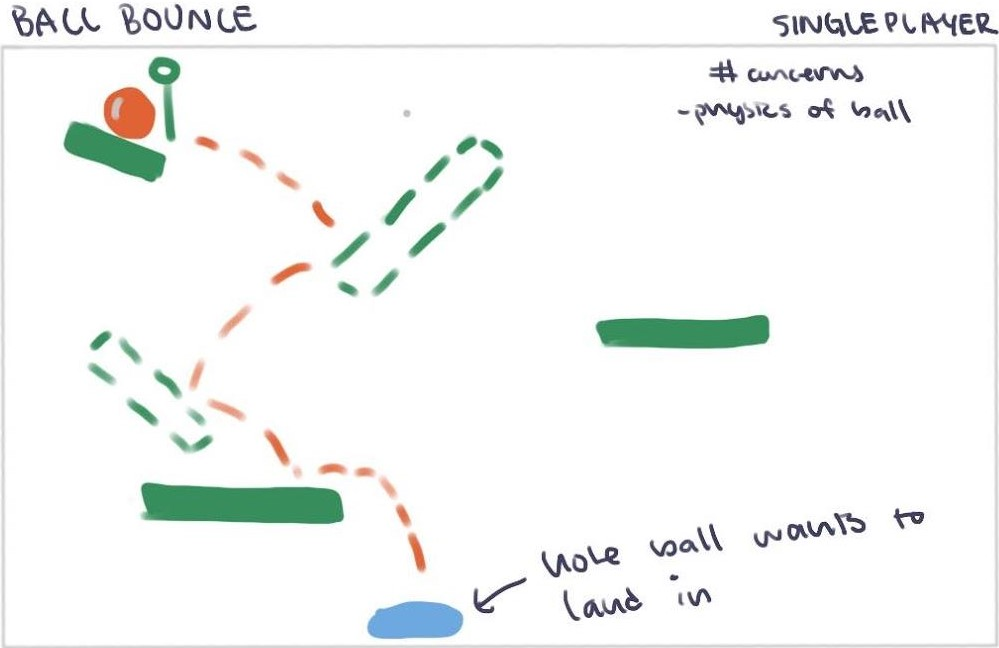

# What is this?

Our project is a game that combines CV and AR into the gameplay. The human player would be able to add obstacles to the game environment by placing them in front of a separate game display screen, OpenCV would detect the obstacles, and these obstacles would be generated through pygame as a component that other features in the game could interact with. This idea is based off of [Puppet.io](https://devpost.com/software/puppet-io), a project we were impressed by at MakeHarvard 2020.

# Instructions
These instructions will get you a copy of the project up and running on your local machine for development and testing purposes. See deployment for notes on how to deploy the project on a live system.

To get started, clone this respository onto your device.

## Prerequisites
To be able to run this game, you must have OpenCV installed. 
- For Ubuntu, use the command `$ pip install opencv-python` or click [here](https://docs.opencv.org/3.4/d2/de6/tutorial_py_setup_in_ubuntu.html) for instructions
- For Windows, click [here](https://docs.opencv.org/master/d5/de5/tutorial_py_setup_in_windows.html) for instructions

## How to Run Our Game
**TODO**: List descriptions of each file, what they do, and what order to run them in. 

# The Game: Development and Results

## Implementation
**TODO**: Add details about the program architecture. Also add program snippets and descriptions of what they do (image filtration, contour capture)
Here is what our 

## See It in Action!
**TODO**: Embed Youtube video of the game being played.

# Our Story and Context

## Narrative

## Ethical Considerations

# Additional Information

### Built With
OpenCV - Detect and process obstacles  
Pygame - Game engine

### Acknowledgments
**TODO**: Acknowledge anyone whose code was used, inspiration, etc
We'd like to thank the [Puppet.io](https://devpost.com/software/puppet-io) team at MakeHarvard 2020 for providing us with inspiration for this project.

### Authors
Jackie Zeng  
Rohil Agarwal

### License
This project is licensed under the MIT License - see the LICENSE.md file for details
